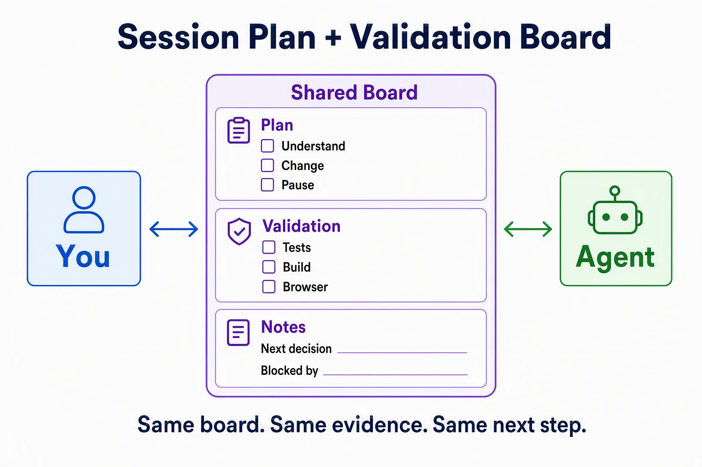
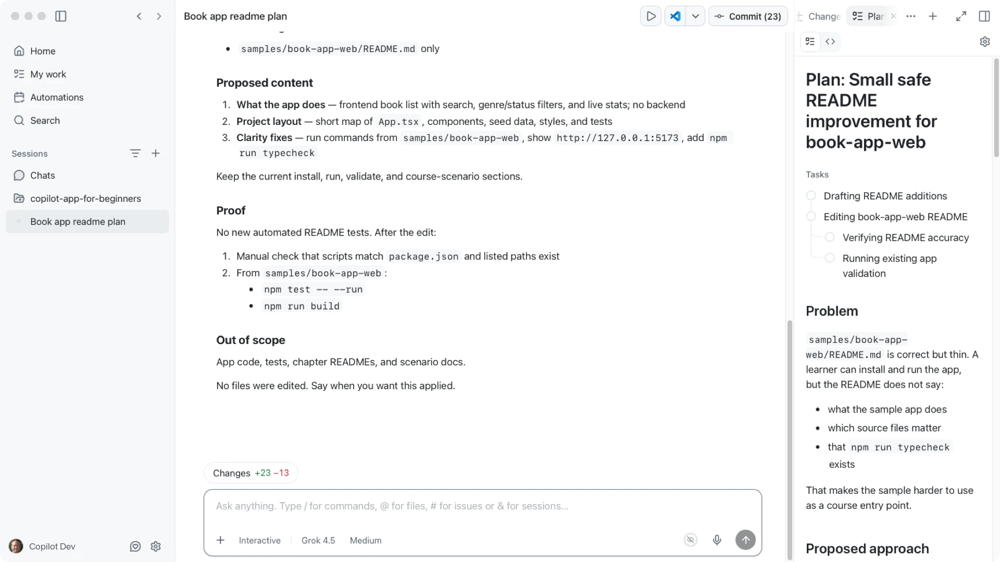
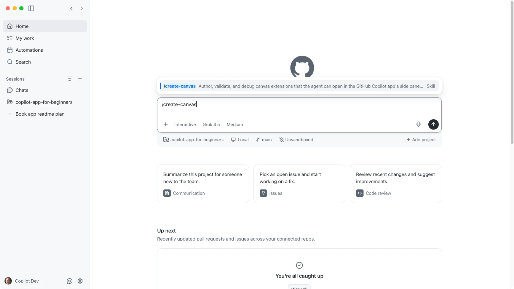

> **What if the agent's work was not trapped in a chat transcript?**

Chat works well for instruction and ambiguity. Once a GitHub Copilot session is doing real work, a long chat thread becomes hard to scan. You need a place where the work itself is visible.

That place is a **canvas**.

A good canvas is not a prettier answer. It is a **shared control panel for the session**: you and GitHub Copilot both look at the same plan, evidence, and next action.

Two related ideas show up in this chapter:

| Term | Meaning in this course |
|---|---|
| Built-in work surfaces | Plan output, terminal, browser, and diff/Review panel tools already in a session |
| Custom canvas | An optional extension you can create later with `/create-canvas` |

Built-in work surfaces are *canvas-style*: they make session work visible. A custom canvas extends that idea with its own UI and shared state. You do not need a custom canvas to learn the beginner path.

In this chapter you'll:

1. Recognize built-in work surfaces you already use: plan, browser, and terminal
2. Track a session plan + validation board for `samples/book-app-web` (markdown is fine)
3. Optionally create a custom canvas later with `/create-canvas`

Creating canvas extensions is advanced. The beginner path stays focused on session control.

## 🎯 Learning Objectives

By the end of this chapter, you'll be able to:

- Explain why canvases exist and when chat is the wrong shape for the job
- Identify built-in work surfaces such as plan, browser, and terminal as canvas-style panels
- Use a session plan + validation board for `samples/book-app-web`
- Keep plan state and validation evidence visible while a session runs
- Explain the difference between chat history and shared canvas state
- Recognize custom canvas extensions and `/create-canvas` as optional next steps

> ⏱️ **Estimated Time**: ~50 minutes (15 min reading + 35 min hands-on)

---

## ✅ Prerequisites

Before starting:

- Complete Chapter 04
- Open the course repository in the GitHub Copilot App
- Use `samples/book-app-web` as the sample app path
- Know how to open the Review panel terminal and browser surfaces from Chapter 03

The prepared concept folder at `.github/extensions/release-checklist` is optional fallback material, not the main exercise.

---

## 🧩 Real-World Analogy: The Band's Arrangement Board

Imagine a band planning a song. They could argue every part in a long group chat, but a shared arrangement board works better:


| Group chat | Arrangement board |
|---|---|
| Good for discussion | Good for shared state |
| Hard to scan later | Easy to inspect at a glance |
| Mostly linear | Can show sections, parts, previews, and controls |
| Updates are buried | Updates are visible |

A canvas is the app's arrangement board for human-agent work.

---

## Core Concepts

### A canvas is a shared control panel

GitHub documents custom canvases as **bidirectional** work surfaces: both sides can change the same board.

Simple example:

1. GitHub Copilot adds plan steps to the board.
2. You uncheck a step or write "pause before edits" in the notes.
3. GitHub Copilot continues from *your* update, not from a buried chat sentence.

A custom canvas can include:

- visible state
- UI controls
- agent-callable capabilities (actions the agent can run on that board, such as updating a checklist item)
- artifacts such as plans, checklists, dashboards, browser previews, terminals, or documents


### Built-in work surfaces come first

You already used canvas-style surfaces in earlier chapters. These are **not** custom canvas extensions. They are the built-in session panels that make work inspectable:

| Built-in work surface | What you inspect |
|---|---|
| Plan | Steps, options, and pause points before implementation |
| Terminal | Install, test, and build evidence |
| Browser | Running app behavior |
| Diff / Review panel | What changed and what still needs review |

Those surfaces matter because they are tied to the live session. Custom canvases are optional. Session control is the point.

### When to use a canvas

| Use chat when... | Use a canvas when... |
|---|---|
| You need a quick answer | You need visible state |
| The task is short | The task has multiple steps |
| The result can be text | The result needs controls or inspection |
| You don't need to revisit it | You want a reusable work surface for the session |


### The beginner example: session plan + validation board

For this course, the main custom example is a board that tracks one session:

```text
Plan
- [ ] Understand empty-state copy
- [ ] Propose a small change
- [ ] Pause for approval
- [ ] Implement
- [ ] Validate

Validation evidence
- [ ] npm test -- --run
- [ ] npm run build
- [ ] browser preview

Session notes
- current mode
- next human decision
- what blocked last turn
```



That board is useful only when it stays linked to evidence from the same session.

---

## Hands-On Exercises

In these exercises, you'll:

- Find built-in work surfaces in the app
- Build a session plan + validation board for the sample app
- Update the board only when evidence exists

### 1. Find the built-in work surfaces

Open or create a session for the course repository.

1. Set mode to **Plan** or **Interactive**.
2. Open the **Review panel** in the upper-right corner of the app.
3. Locate the **Terminal** tab. Create a terminal if needed.
4. Locate the **Browser** surface or browser tab if your build exposes it.
5. Notice where plan output appears in the session when you ask for a plan.



#### Expected result

You can point to at least two built-in work surfaces that make session work inspectable without scrolling the full chat.

#### How it works

Chat still carries the conversation. The plan, terminal, browser, and diff surfaces carry the work. That split is the canvas *idea*. A custom canvas extension is optional and comes later.

---

### 2. Create a session plan + validation board

Stay in the same session. Ask GitHub Copilot:

```text
Create a session plan + validation board for improving empty-state copy in @samples/book-app-web.

Use this structure and keep it updated as shared state:

Plan
- [ ] Understand current empty-state copy
- [ ] Propose one small beginner-safe improvement
- [ ] Pause for my approval before editing files
- [ ] Implement the approved change
- [ ] Validate

Validation evidence
- [ ] cd samples/book-app-web && npm test -- --run
- [ ] cd samples/book-app-web && npm run build
- [ ] browser preview on 127.0.0.1:5173

Session notes
- current mode
- next human decision
- blockers

If a custom canvas is available, put the board there.
If not, return the board as markdown and keep it updated each turn.
Markdown is a complete success for this exercise.
Do not edit files yet.
```

#### Expected output

- A board with plan steps, validation checks, and session notes
- A clear pause before file edits
- No file changes yet

Demo output varies. What matters is that the board is scannable and tied to this session.

#### Pause point

Before any implementation:

1. Is the proposed change small?
2. Is the pause point explicit?
3. Are validation commands exact?
4. Can you tell the next human decision without rereading the whole chat?

---

### 3. Update the board with real evidence

Now collect evidence and update the board. Prefer the session terminal and browser surfaces.

```bash
cd samples/book-app-web
npm install
npm test -- --run
npm run build
```

For browser validation:

```bash
cd samples/book-app-web
npm run dev -- --host 127.0.0.1 --port 5173
```

Prompt GitHub Copilot:

```text
Update the session plan + validation board for samples/book-app-web.
Mark only the steps that have evidence from terminal or browser output in this session.
If a custom canvas is available, update that surface.
If not, return the full board as markdown.
Markdown is enough.
Do not invent passing results.
```

<!-- app-screenshot: Canvas controls or markdown board being updated after terminal or browser evidence. -->

#### Expected output

- Terminal output shows install, test, and build evidence
- Browser preview runs at `127.0.0.1:5173` when you start it
- Board state matches what you actually verified
- Unchecked items stay unchecked until evidence exists

#### Why this matters

A confident chat sentence is not validation. The board should change only when the terminal, browser, or diff gives you proof.

---

<details>
<summary>Optional fallback: release checklist concept</summary>

If you want a second shape to compare, open:

```text
.github/extensions/release-checklist/README.md
```

That folder is a design concept, not a loadable extension. It is useful as a release-oriented checklist, but it is not the hero example for this chapter. Prefer the session plan + validation board because it stays tied to the live session.

</details>

<details>
<summary>Intermediate: Markdown workboards that launch and track sessions</summary>

Official docs also describe markdown canvases that can combine prioritized issues and pull requests, then help launch and track agent sessions from one surface.

That pattern is powerful when your day spans several workstreams. For this beginner chapter, stay with one session board first. After that feels natural, a multi-session workboard is a strong next step.

Example stretch prompt:

```text
Design a markdown workboard for this repository that lists open issues and pull requests, lets me choose one item, and tracks the session status for that item. Do not create an extension yet. Return the board design only.
```

</details>

<details>
<summary>Advanced: Project-scoped and user-scoped canvases</summary>

Custom canvases can live in different places:

| Location | Scope | Best for |
|---|---|---|
| `.github/extensions` | Project or team | Shared course and team workflows |
| `~/.copilot/extensions` | User | Personal experiments |

Project-scoped canvases can become team assets. User-scoped canvases are better for experiments that should not be committed.

A canvas extension commonly includes:

- `package.json` for metadata and dependencies
- an entry file such as `extension.mjs`
- optional JSON artifacts for persisted state

</details>

<details>
<summary>Advanced: Canvas authoring and `/create-canvas`</summary>

Create or revise a canvas only after the session board workflow feels clear.

Optional stretch prompt:

```text
/create-canvas Create a session plan + validation board canvas for samples/book-app-web.

People should be able to:
- check and uncheck plan steps
- check validation items only after evidence exists
- edit session notes

The agent should be able to:
- update plan status
- mark validation items from terminal or browser evidence
- record the next human decision

Keep the first version simple. No GitHub write actions.
```



Pause before accepting generated extension code. Inspect:

- capability names
- input schemas
- stored state
- UI controls
- whether any private data is included

If a canvas fails to open after edits, check extension dependencies, reload requirements, syntax errors, and whether the app is reading the project-scoped or user-scoped extension.

</details>

---

## Troubleshooting

<details>
<summary>Canvas issues</summary>

| Problem | What to check |
|---|---|
| No custom canvas opens | That is fine for the beginner path; use markdown board state in the session |
| Built-in terminal or browser missing | Review panel toggle, View menu, app version |
| Agent says it updated the board but state looks wrong | Ask for the full board again and compare it with terminal or browser evidence |
| Validation marked complete without proof | Require evidence; uncheck items that lack output |
| Browser or terminal validation is stale | Confirm the command ran in the correct `samples/book-app-web` worktree |
| Sensitive data appears in a custom canvas | Remove it, regenerate safe sample data, retake screenshots |

</details>

---

## 🔑 Key Takeaways

1. Chat is for conversation. Canvases and canvas-style surfaces are for visible, shared work.
2. A good canvas is a shared control panel for the session, not a prettier answer.
3. Master built-in work surfaces first: plan, browser, terminal, and diff.
4. A session plan + validation board keeps pause points and evidence scannable.
5. Update board state only when evidence exists.
6. Custom canvas extensions and `/create-canvas` are optional advanced steps.

---

## 📝 Assignment


Run one small session with a visible board:

1. Create a session plan + validation board for one beginner-safe improvement in `samples/book-app-web`.
2. Keep a pause point before file edits.
3. Run `npm test -- --run` and `npm run build`.
4. Mark board items only after evidence exists.
5. Ask GitHub Copilot to summarize what remains unchecked and what the next human decision is.

Success criteria: You're able to explain the difference between a chat answer and shared session board state.

---

## ➡️ What's Next

In the next chapter, you'll turn repeatable prompts into automations. You'll start with a manual open-work summary before trying schedules or cloud workflows.

**[← Back to Chapter 04](../04-skills-mcp-plugins/README.md)** | **[Next: Automations →](../06-automations/README.md)**

---

## Source References

- [Working with canvas extensions](https://docs.github.com/en/copilot/how-tos/github-copilot-app/working-with-canvas-extensions)
- [Customizing the GitHub Copilot app](https://docs.github.com/en/copilot/how-tos/github-copilot-app/customize-github-copilot-app)
- [GitHub Copilot App generally available](https://github.blog/changelog/2026-06-17-github-copilot-app-generally-available/)
- [GitHub Copilot App product blog](https://github.blog/news-insights/product-news/github-copilot-app-the-agent-native-desktop-experience/)
